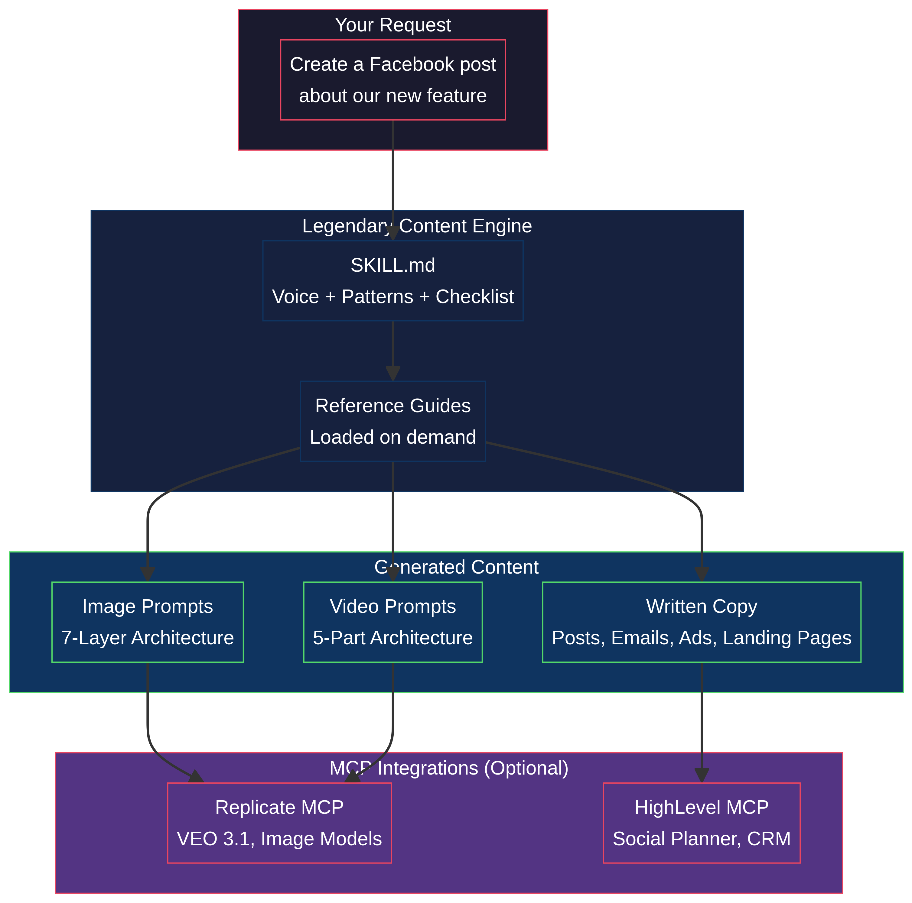
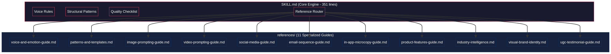
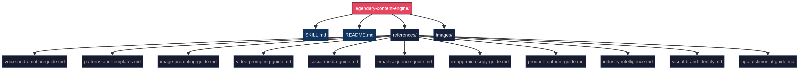
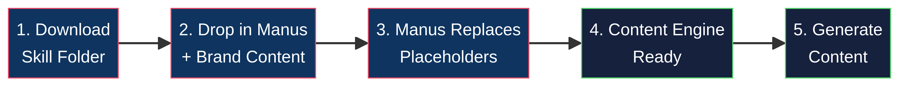

# Legendary Content Engine for Manus

A comprehensive, open-source content generation skill for Manus. This skill transforms Manus into a dedicated content engine that produces marketing copy, social media posts, email sequences, and AI generation prompts (images and video) that perfectly match your brand's voice and visual identity.

## What This Skill Does

The Legendary Content Engine provides Manus with a structured framework for creating high-quality, brand-aligned content across multiple formats. Instead of relying on generic AI outputs, this skill enforces:

- **Consistent Brand Voice**: Rules for tone, emotional layering, and vocabulary.
- **Structural Patterns**: Proven copywriting frameworks (e.g., Identity Disruption, Progressive Realization).
- **Visual Identity**: Strict guidelines for image and video generation prompts.
- **Platform Adaptation**: Specific rules for Facebook, LinkedIn, Instagram, and TikTok.

## How It Works: The Progressive Disclosure Model

This skill uses a "progressive disclosure" architecture to manage context window limits. The main `SKILL.md` file contains the core routing logic and voice rules. When you ask Manus to create specific content, it reads only the relevant reference guide for that task.

## Installation and Personalization

This skill is designed to be personalized with your specific brand information before use.

### Step 1: Download and Extract
Download the `legendary-content-engine.zip` file and extract it to your local machine.

### Step 2: Personalize the Placeholders
Throughout the `SKILL.md` and the 11 reference files in the `references/` directory, you will find placeholders formatted like `{{PLACEHOLDER_NAME}}`. 

You have two options for personalization:

**Option A: Manual Personalization (Recommended for precision)**
Open the files in a text editor and replace the placeholders with your brand's specific details.

**Option B: AI-Assisted Personalization**
1. Upload the extracted folder to your Manus environment.
2. Upload a document containing your brand guidelines, product details, and target audience information.
3. Use this prompt in Manus:
   > "I have uploaded the legendary-content-engine skill folder and my brand guidelines document. Please read my brand guidelines, then go through every file in the legendary-content-engine folder and replace all the `{{PLACEHOLDER}}` values with the appropriate information from my brand. Save the updated files."

### Step 3: Install the Skill in Manus
Once personalized, ensure the folder is placed in your Manus `/home/ubuntu/skills/` directory.

## Using the Content Engine

Once installed, you can trigger the skill by asking Manus to create content.

### Example Prompts

**For Social Media:**
> "Use the legendary-content-engine skill to write a LinkedIn post about our new feature launch. Make sure to follow the hook requirements for LinkedIn."

**For Image Generation:**
> "Use the legendary-content-engine skill to write a Nano Banana Pro image prompt for a hero image on our new landing page. Follow the 7-layer architecture."

**For Email Sequences:**
> "Use the legendary-content-engine skill to draft a 3-part welcome email sequence for new subscribers."

## Completing the System: MCP Integrations

To turn this skill into a fully automated content pipeline, you can integrate external tools using the Model Context Protocol (MCP).

### 1. Video and Image Generation (Replicate MCP)

Connect the Replicate MCP server to allow Manus to generate images and videos directly from the prompts it creates.

**Setup:**
1. Configure the Replicate MCP server in your Manus environment with your API key.
2. Ensure models like `google/veo-2` or `google/veo-3.1` are available.

**Use Case Example:**
> "Use the legendary-content-engine to write a VEO 3.1 video prompt for a 10-second brand reveal. Then, use the Replicate MCP to generate the video using that prompt."

### 2. Social Media Publishing (HighLevel MCP)

Connect the HighLevel (GHL) MCP server to allow Manus to draft content and schedule it directly to your social planner.

**Setup:**
1. Configure the HighLevel MCP server with your location API key.
2. Ensure the social planner endpoints are accessible.

**Use Case Example:**
> "Use the legendary-content-engine to write a week's worth of Facebook posts based on our core pillars. Then, use the HighLevel MCP to schedule them in the social planner for next Monday through Friday at 10 AM."

## File Reference Guide

| File | Purpose | When Manus Uses It |
|------|---------|-------------------|
| `SKILL.md` | Core engine, voice rules, routing | Every time the skill is triggered |
| `voice-and-emotion-guide.md` | Deep emotional layering, founder voice | Brand narrative, deep copy |
| `patterns-and-templates.md` | Copy structures, templates, anti-patterns | Landing pages, emails, ads |
| `image-prompting-guide.md` | 7-layer prompt architecture | Creating image generation prompts |
| `video-prompting-guide.md` | 5-part prompt architecture | Creating video generation prompts |
| `social-media-guide.md` | Platform-specific rules | Writing social posts |
| `email-sequence-guide.md` | Sequence structures, subject lines | Writing email campaigns |
| `in-app-microcopy-guide.md` | UI text, buttons, errors | Writing product interface copy |
| `product-features-guide.md` | Feature framing, benefit translation | Writing product descriptions |
| `industry-intelligence.md` | Conversion psychology, positioning | Strategic content planning |
| `visual-brand-identity.md` | Colors, typography, motifs | Visual direction |
| `ugc-testimonial-guide.md` | Social proof curation | Formatting client stories |

---
*Created for the Manus AI Agent Ecosystem by Legend Mario Aldayuz.*
